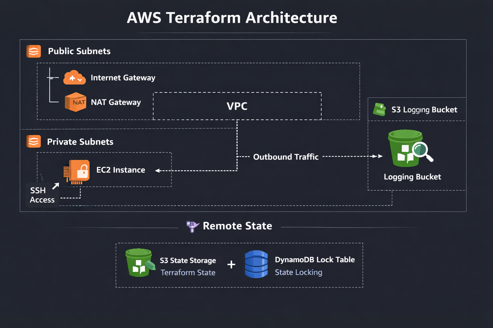

# Terraform AWS Environment

Production-ready Terraform environment with VPC, subnets, routing, security groups, EC2, S3 logging, and remote state (S3 + DynamoDB).  
Designed for secure, repeatable deployments across dev/staging/prod.


## 📌 Overview

This project demonstrates how to build a **real-world, production-grade AWS environment** using Terraform. It includes:

- Remote state backend (S3 + DynamoDB)  
- VPC with public and private subnets  
- Internet Gateway + NAT Gateway  
- Route tables + associations  
- EC2 instance in private subnet  
- IAM role + instance profile  
- S3 logging bucket with encryption + versioning  
- Parameterized variables for multi-environment deployments  
- Outputs for integration with other Terraform modules  

This mirrors the architecture used by CloudOps, DevOps, and Platform Engineering teams in real companies.


## 🎯 Business Problem

Companies need **secure, repeatable cloud environments** that can be deployed across:

- development  
- staging  
- production  

They also need:

- centralized logging  
- secure compute  
- private networking  
- controlled outbound access  
- consistent infrastructure  
- safe Terraform state management  

This project solves those problems using industry best practices.


## 🏗️ Architecture Diagram (Conceptual)

AWS VPC  
├── Public Subnets  
│   ├── NAT Gateway  
│   └── Internet Gateway  
│  
├── Private Subnets  
│   └── EC2 Instance (no public IP)  
│  
└── S3 Logging Bucket  

Remote state:  
- S3 bucket: `terraform-aws-env-state`  
- DynamoDB table: `terraform-aws-env-locks`


## 🖼️ Architecture Diagram (Visual)



## 🧩 Key Features

### 🔹 Remote State Backend  
Terraform state stored in S3 with DynamoDB locking to prevent corruption.

### 🔹 Secure Networking  
VPC with public/private subnets, IGW, NAT, and proper routing.

### 🔹 Private Compute  
EC2 instance deployed in a private subnet with outbound-only internet access.

### 🔹 IAM Best Practices  
EC2 uses an IAM role — no access keys stored on the instance.

### 🔹 Centralized Logging  
Dedicated S3 bucket for logs with encryption + versioning.

### 🔹 Parameterized Variables  
Supports dev/staging/prod through variables and tfvars files.

### 🔹 Reusable Outputs  
Exposes VPC, subnets, EC2 IP, and S3 bucket for other modules.


## 📦 Project Structure
```text
Terraform-AWS-Environment/
├── backend.tf
├── main.tf
├── variables.tf
├── outputs.tf
├── versions.tf
└── README.md
```


## 🚀 Deployment Instructions

### 1. Clone the repo

    git clone https://github.com/GarciaAlexander/Terraform-AWS-Environment.git
    cd Terraform-AWS-Environment

### 2. Create your personal tfvars file (not committed)

    touch dev.tfvars

Add this inside the file:

    ssh_allowed_ip = "YOUR_PUBLIC_IP/32"

### 3. Initialize Terraform

    terraform init

### 4. Validate the configuration

    terraform validate

### 5. Preview changes

    terraform plan -var-file="dev.tfvars"

### 6. Deploy the environment

    terraform apply -var-file="dev.tfvars"


## 🛡️ Security Considerations

- EC2 instance has **no public IP**  
- SSH access is **restricted to your IP**  
- S3 logging bucket is **fully private**  
- All resources follow **least privilege**  
- Remote state is **encrypted + versioned**


## 👤 Author

**Alexander Garcia**  
AWS CloudOps Engineer • Terraform • Infrastructure-as-Code


## 🏁 Final Notes

This project demonstrates real CloudOps skills:

- secure architecture  
- Terraform best practices  
- reusable infrastructure  
- production-ready design  
- clear documentation  

